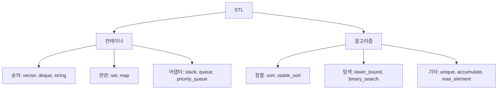

## 개요

C++ 표준 라이브러리(STL)는 동적 배열, 정렬, 이진 탐색 등 자주 쓰는 자료구조와 알고리즘을 미리 구현해 둔 도구상자입니다. 직접 짤 필요 없이 가져다 쓰면 되므로, **무엇이 있고 각 연산의 복잡도가 얼마인지** 아는 것이 곧 생산성입니다.



이 글은 가장 기본인 `vector`·`string`과 자주 쓰는 알고리즘에 집중합니다. `set`/`map`과 어댑터는 별도 글에서 다룹니다.

## vector — 동적 배열

크기를 자유롭게 바꿀 수 있는 배열입니다. PS에서 일반 배열 대신 거의 항상 `vector`를 씁니다.

```cpp
#include <bits/stdc++.h>
using namespace std;

int main() {
    vector<int> a = {5, 3, 8, 1};
    a.push_back(9);          // 맨 뒤 추가  -> {5,3,8,1,9}
    a.pop_back();            // 맨 뒤 제거  -> {5,3,8,1}
    cout << a.size() << "\n";// 원소 개수
    cout << a[0] << "\n";    // 인덱스 접근

    // 2차원 배열: n행 m열을 0으로 초기화
    int n = 3, m = 4;
    vector<vector<int>> grid(n, vector<int>(m, 0));
}
```
{: file="vector.cpp" }

> `a[i]`는 범위 검사를 하지 않습니다. 잘못된 인덱스 접근은 런타임 에러나 엉뚱한 값으로 이어지니 주의하세요.
{: .prompt-warning }

## string — 문자열

`string`은 사실상 문자들의 `vector`입니다. 덧셈으로 이어 붙이고, 인덱스로 문자에 접근합니다.

```cpp
string s = "algo";
s += "rithm";          // "algorithm"
cout << s.size() << "\n";
cout << s.substr(0, 4) << "\n";  // "algo"
sort(s.begin(), s.end());        // 문자 정렬
```
{: file="string.cpp" }

## 자주 쓰는 STL 알고리즘

| 함수 | 용도 | 복잡도 |
|------|------|--------|
| `sort(b, e)` | 정렬 | $O(n \log n)$ |
| `lower_bound(b, e, x)` | $x$ 이상 첫 위치 | $O(\log n)$ |
| `upper_bound(b, e, x)` | $x$ 초과 첫 위치 | $O(\log n)$ |
| `binary_search(b, e, x)` | 존재 여부 | $O(\log n)$ |
| `unique(b, e)` | 인접 중복 제거 | $O(n)$ |
| `max_element(b, e)` | 최댓값 위치 | $O(n)$ |
| `accumulate(b, e, 0)` | 합 | $O(n)$ |

`lower_bound`/`upper_bound`는 **정렬된** 구간에서만 올바르게 동작합니다.

```cpp
vector<int> v = {1, 3, 3, 5, 7};
// v에서 3 이상이 처음 나오는 위치의 인덱스
int idx = lower_bound(v.begin(), v.end(), 3) - v.begin();  // 1
// 5 초과가 처음 나오는 위치
int cnt = upper_bound(v.begin(), v.end(), 5) - v.begin();  // 4
```
{: file="binary_search.cpp" }

## 응용 — 좌표 압축

값의 범위는 크지만 서로 다른 값의 개수가 적을 때, 값들을 `0, 1, 2, ...`로 다시 매기는 기법입니다. `sort` + `unique` + `lower_bound` 세 가지의 대표적 조합입니다.

```cpp
vector<int> v = {100, 7, 7, 50, 100};

vector<int> sorted_v = v;
sort(sorted_v.begin(), sorted_v.end());
sorted_v.erase(unique(sorted_v.begin(), sorted_v.end()), sorted_v.end());
// sorted_v = {7, 50, 100}

for (int x : v) {
    int compressed = lower_bound(sorted_v.begin(), sorted_v.end(), x) - sorted_v.begin();
    cout << compressed << " ";   // 100->2, 7->0, 7->0, 50->1, 100->2
}
```
{: file="coordinate_compression.cpp" }

> `unique`는 **인접한** 중복만 제거하므로 반드시 먼저 `sort` 해야 합니다. 또한 `unique`는 실제로 원소를 지우지 않고 "유효 구간의 끝"을 반환하므로 `erase`와 함께 씁니다.
{: .prompt-tip }

## 연습문제

| 출처 | 문제 | 핵심 포인트 |
|------|------|-------------|
| 프로그래머스 | [완주하지 못한 선수](https://school.programmers.co.kr/learn/courses/30/lessons/42576) | map / multiset 활용 |
| Codeforces 339A | [Helpful Maths](https://codeforces.com/problemset/problem/339/A) | string 정렬 |
| Codeforces 4C | [Registration system](https://codeforces.com/problemset/problem/4/C) | map으로 중복 관리 |
| BOJ 18870 | 좌표 압축 *(번호로만 표기)* | sort + unique + lower_bound |

> BOJ(백준)는 2026-04-28 사이트 종료로 링크 대신 번호만 표기합니다.
{: .prompt-info }
