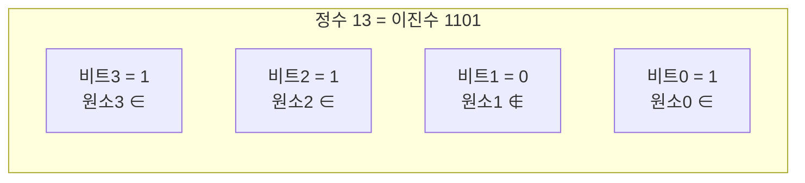

## 개요

**완전탐색(brute force)**은 가능한 모든 경우를 빠짐없이 확인하는 방법입니다. 똑똑하진 않지만 **정답을 반드시 찾는다**는 강력한 장점이 있어, 입력이 작을 때(앞 글의 시간 제한 감각 참고) 가장 먼저 고려할 전략입니다.

**비트마스킹(bitmask)**은 정수 하나의 각 비트를 원소의 포함 여부로 해석해 집합을 표현하는 기법입니다. $n$개 원소의 부분집합을 $0$부터 $2^n - 1$까지의 정수로 나타낼 수 있어, 부분집합 완전탐색을 간결하고 빠르게 구현합니다.

> 원소가 약 20개 이하($2^{20} \approx 10^6$)면 모든 부분집합을 순회해도 시간 안에 들어옵니다. 비트마스킹이 빛나는 전형적인 범위입니다.
{: .prompt-info }

## 완전탐색의 유형

| 유형 | 구현 | 경우의 수 |
|------|------|-----------|
| 중첩 반복문 | for 여러 겹 | $O(n^k)$ |
| 부분집합 | 재귀 또는 비트마스킹 | $O(2^n)$ |
| 순열 | 백트래킹 / `next_permutation` | $O(n!)$ |

부분집합·순열 탐색은 [재귀와 백트래킹]({{ '/posts/recursion-backtracking/' | relative_url }})에서 다뤘습니다. 이 글은 그중 **부분집합을 비트로 표현**하는 방법에 집중합니다.

## 비트로 집합 표현하기

집합 $\{0, 2, 3\}$을 길이 4의 비트열로 보면 `1101`(이진수) $= 13$입니다. $i$번째 비트가 켜져 있으면 원소 $i$가 집합에 속한다는 뜻입니다.



## 비트 연산 정리

`mask`를 집합, `i`를 원소 번호라 할 때 기본 연산은 다음과 같습니다.

| 동작 | 코드 | 설명 |
|------|------|------|
| 원소 $i$ 추가 | `mask \| (1 << i)` | $i$번 비트 켜기 |
| 원소 $i$ 제거 | `mask & ~(1 << i)` | $i$번 비트 끄기 |
| 원소 $i$ 토글 | `mask ^ (1 << i)` | 켜짐/꺼짐 반전 |
| 원소 $i$ 포함? | `mask & (1 << i)` | 0이 아니면 포함 |
| 원소 개수 | `__builtin_popcount(mask)` | 켜진 비트 수 |
| 공집합 | `0` | 모든 비트 꺼짐 |
| 전체집합 | `(1 << n) - 1` | 하위 $n$비트 모두 켜짐 |

```cpp
int mask = 0;
mask |= (1 << 2);              // {2}
mask |= (1 << 0);              // {0, 2}
if (mask & (1 << 2)) { }       // 2 포함 → 참
mask &= ~(1 << 2);             // {0}
cout << __builtin_popcount(mask); // 1
```
{: file="bit_ops.cpp" }

## 모든 부분집합 순회

핵심 패턴입니다. $0$부터 $2^n - 1$까지 모든 정수가 곧 모든 부분집합이므로, 바깥 루프로 부분집합을, 안쪽 루프로 포함된 원소를 확인합니다.

```cpp
#include <bits/stdc++.h>
using namespace std;

int main() {
    int n = 3;
    for (int mask = 0; mask < (1 << n); mask++) {
        cout << "{ ";
        for (int i = 0; i < n; i++)
            if (mask & (1 << i)) cout << i << " ";
        cout << "}\n";
    }
}
```
{: file="iterate_subsets.cpp" }

## 복잡도

모든 부분집합($2^n$개)마다 원소 $n$개를 확인하므로 $O(2^n \cdot n)$입니다.

$$
\text{부분집합 순회}: O(2^n \cdot n)
$$

`__builtin_popcount` 같은 비트 연산 자체는 $O(1)$입니다.

## 변형 / 응용

- **비트마스크 DP** — `dp[mask]`로 "이미 처리한 원소 집합" 상태를 저장합니다. 외판원 순회(TSP) 등에서 핵심이며, 4단계 DP에서 자세히 다룹니다.
- **`__builtin_ctz` / `__builtin_clz`** — 켜진 최하위/최상위 비트 위치를 $O(1)$에 구합니다.
- **부분집합의 부분집합 순회** — `for (int s = mask; s; s = (s - 1) & mask)` 패턴으로 특정 집합의 모든 부분집합만 효율적으로 훑습니다.

## 연습문제

| 출처 | 문제 | 핵심 포인트 |
|------|------|-------------|
| AtCoder ABC128 C | [Switches](https://atcoder.jp/contests/abc128/tasks/abc128_c) | 비트 완전탐색 |
| 프로그래머스 | [모의고사](https://school.programmers.co.kr/learn/courses/30/lessons/42840) | 단순 완전탐색 |
| 프로그래머스 | [카펫](https://school.programmers.co.kr/learn/courses/30/lessons/42842) | 약수 완전탐색 |
| BOJ 1182 | 부분수열의 합 *(번호로만 표기)* | 부분집합 비트마스킹 |
| BOJ 11723 | 집합 *(번호로만 표기)* | 비트마스크 집합 연산 |

> BOJ(백준)는 2026-04-28 사이트 종료로 링크 대신 번호만 표기합니다.
{: .prompt-info }
