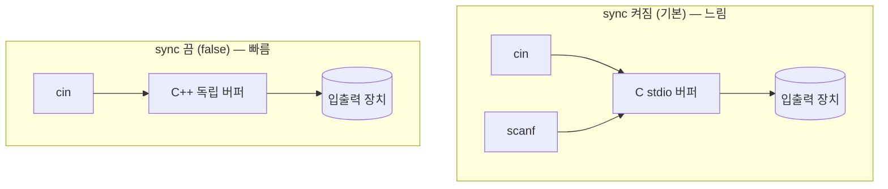

## 개요

PS/CP에서 C++을 가장 많이 쓰는 이유는 **빠른 실행 속도**와 **풍부한 표준 라이브러리(STL)** 때문입니다. 같은 알고리즘이라도 언어에 따라 수 배의 속도 차이가 나는데, 1초 안팎의 빡빡한 시간 제한에서는 이 차이가 정답과 시간 초과(TLE)를 가릅니다.

그런데 알고리즘이 아무리 빨라도 **입출력이 느리면 TLE**가 납니다. C++의 `cin`/`cout`은 편리하지만 기본 설정에서는 느리기 때문에, 입력이 수십만 줄을 넘어가면 입출력 최적화가 필수입니다.

> 이 글은 "어떤 알고리즘을 쓸까"가 아니라 "풀이 코드를 어떻게 시작하고, 입출력에서 시간을 잃지 않을까"를 다룹니다. 모든 문제 풀이의 공통 토대입니다.
{: .prompt-info }

## 풀이 코드의 기본 골격

대부분의 C++ 풀이는 아래 형태로 시작합니다.

```cpp
#include <bits/stdc++.h>
using namespace std;

int main() {
    ios_base::sync_with_stdio(false);
    cin.tie(NULL);

    // 입력 → 처리 → 출력
    return 0;
}
```
{: file="template.cpp" }

- `#include <bits/stdc++.h>` — GCC에서 모든 표준 헤더를 한 번에 포함합니다. 헤더를 일일이 적을 필요가 없어 PS에서 관습적으로 씁니다. (단, 표준이 아니므로 실무 코드에는 쓰지 않습니다.)
- `using namespace std;` — `std::` 접두사를 생략합니다.
- 가운데 두 줄이 **빠른 입출력** 설정입니다. 다음 절에서 자세히 봅니다.

## 빠른 입출력은 왜 필요한가

`cin`/`cout`은 기본적으로 C의 `scanf`/`printf`와 **버퍼를 동기화**합니다. 두 입출력 방식을 섞어 써도 순서가 꼬이지 않도록 보장하기 위해서인데, 이 동기화 비용 때문에 느려집니다.



`ios_base::sync_with_stdio(false);`로 이 동기화를 끄면 `cin`/`cout`이 독립 버퍼를 써서 훨씬 빨라집니다.

> 동기화를 끄면 `scanf`/`printf`와 `cin`/`cout`을 **섞어 쓰면 안 됩니다.** 출력 순서가 꼬일 수 있습니다. 둘 중 하나만 쓰세요.
{: .prompt-warning }

`cin.tie(NULL);`은 `cin`과 `cout`의 묶음(tie)을 끊습니다. 기본적으로 `cin` 입력 직전마다 `cout`이 자동 flush 되는데, 이 자동 flush를 없애 입력 속도를 높입니다.

### `endl` 대신 `"\n"`

`endl`은 줄바꿈과 **동시에 출력 버퍼를 flush**합니다. 출력이 많을 때 매번 flush 하면 매우 느려집니다. 줄바꿈만 필요하다면 `"\n"`을 쓰세요.

```cpp
cout << ans << endl;   // 느림: 매번 flush
cout << ans << "\n";   // 빠름: 버퍼에 쌓았다가 한 번에 출력
```
{: file="endl_vs_newline.cpp" }

## 복잡도

입출력 자체의 시간복잡도는 데이터 크기에 비례하는 $O(N)$입니다. 알고리즘 복잡도를 바꾸지는 못하지만, **상수 계수가 큽니다.** 같은 $O(N)$이라도 동기화 여부에 따라 실측 속도가 몇 배씩 차이 납니다.

| 방식 | 상대적 속도 | 비고 |
|------|------------|------|
| `cin`/`cout` (기본) | 느림 | 동기화 비용 |
| `cin`/`cout` + sync 끔 + `"\n"` | 빠름 | PS 표준 |
| `scanf`/`printf` | 빠름 | 형식 지정 번거로움 |

입력이 대략 $10^6$ 줄을 넘어가면 빠른 입출력이 사실상 필수입니다.

## 변형 / 응용

### 한 줄 전체 읽기 — `getline`

공백을 포함한 한 줄을 통째로 읽을 때는 `getline`을 씁니다.

```cpp
string line;
getline(cin, line);   // 개행 전까지 전부 읽음
```
{: file="getline.cpp" }

> `cin >> x` 다음에 `getline`을 쓰면, 남아 있는 개행 문자(`\n`)부터 읽혀 빈 줄이 들어옵니다. `cin >> ws`로 앞쪽 공백·개행을 버리거나, `cin.ignore()`로 개행을 한 번 건너뛰세요.
{: .prompt-tip }

### 실수 출력 정밀도

부동소수점을 고정 소수점 자릿수로 출력하려면 `fixed`와 `setprecision`을 함께 씁니다.

```cpp
#include <bits/stdc++.h>
using namespace std;

int main() {
    double pi = 3.141592653589793;
    cout << fixed << setprecision(6) << pi << "\n";  // 3.141593
}
```
{: file="precision.cpp" }

### 자료형 주의 — 오버플로

정수 범위를 넘기 쉬운 곳에서는 `long long`을 씁니다. `int`는 약 $\pm 2.1 \times 10^9$까지만 안전합니다.

```cpp
long long a, b;
cin >> a >> b;
cout << a * b << "\n";   // a, b가 크면 int로는 오버플로
```
{: file="overflow.cpp" }

## 연습문제

| 출처 | 문제 | 핵심 포인트 |
|------|------|-------------|
| AtCoder Practice A | [Welcome to AtCoder](https://atcoder.jp/contests/practice/tasks/practice_1) | 기본 입출력 형식 익히기 |
| Codeforces 4A | [Watermelon](https://codeforces.com/problemset/problem/4/A) | 입력 + 조건 분기 |
| Codeforces 1A | [Theatre Square](https://codeforces.com/problemset/problem/1/A) | `long long`, 올림 계산 |
| BOJ 2557 | Hello World *(번호로만 표기)* | 첫 출력 |
| BOJ 15552 | 빠른 A+B *(번호로만 표기)* | 빠른 입출력 필수 체감 |

> BOJ(백준)는 2026-04-28 사이트 종료로 링크를 걸 수 없어 문제 번호만 표기합니다. 같은 유형을 Codeforces·AtCoder에서 연습하세요.
{: .prompt-info }
