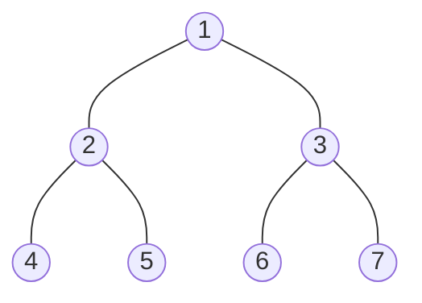
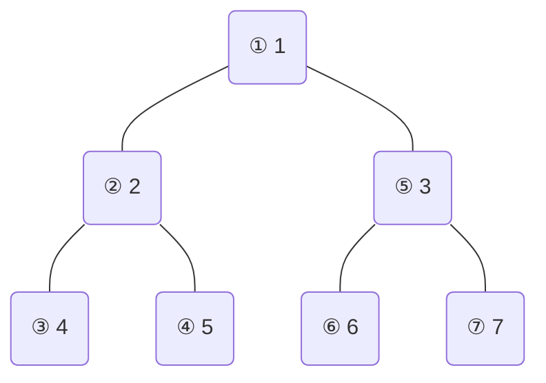
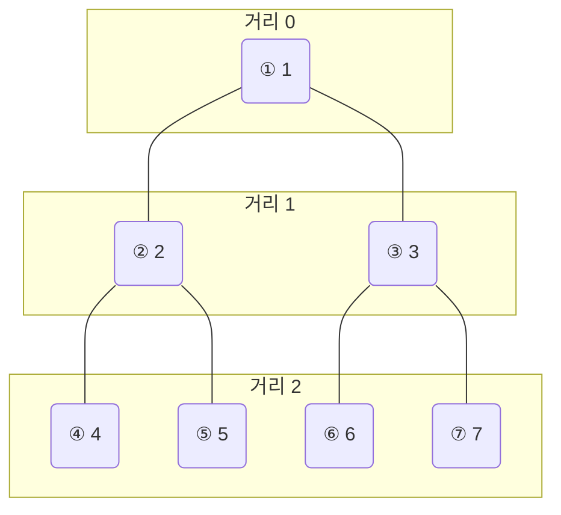

## 개요

그래프의 모든 정점을 방문하는 방법은 크게 두 가지입니다.

- **DFS** (Depth-First Search, 깊이 우선 탐색) — 갈 수 있는 한 깊이 내려간 뒤 되돌아옴
- **BFS** (Breadth-First Search, 너비 우선 탐색) — 가까운 정점부터 차례로 방문

두 알고리즘 모두 시간복잡도는 $O(V + E)$ (V: 정점 수, E: 간선 수)로 같지만, 탐색 순서와 적합한 문제 유형이 다릅니다.

> DFS와 BFS 중 어느 것이 더 좋다는 건 없습니다. 문제의 성질에 따라 적합한 방법이 다릅니다.
{: .prompt-info }

## 예시 그래프

아래 그래프를 기준으로 설명합니다. 정점 1에서 탐색을 시작하고, 인접 정점은 번호 오름차순으로 방문합니다.



## DFS

스택(또는 재귀 호출 스택)을 사용합니다. 한 방향으로 끝까지 내려가다가 막히면 되돌아와서 다른 방향으로 탐색합니다.

**탐색 순서**: 1 → 2 → 4 → 5 → 3 → 6 → 7



### 재귀 구현

```cpp
#include <bits/stdc++.h>
using namespace std;

vector<int> adj[1001];
bool visited[1001];

void dfs(int v) {
    visited[v] = true;
    cout << v << " ";
    for (int next : adj[v]) {
        if (!visited[next])
            dfs(next);
    }
}
```
{: file="dfs.cpp" }

재귀 깊이가 수만 이상이면 스택 오버플로가 발생할 수 있습니다. 이 경우 명시적 스택으로 바꿔야 합니다.

```cpp
void dfs_stack(int start) {
    stack<int> st;
    st.push(start);
    visited[start] = true;
    while (!st.empty()) {
        int v = st.top(); st.pop();
        cout << v << " ";
        for (int i = adj[v].size() - 1; i >= 0; i--) {
            int next = adj[v][i];
            if (!visited[next]) {
                visited[next] = true;
                st.push(next);
            }
        }
    }
}
```
{: file="dfs_stack.cpp" }

> 스택 DFS에서 인접 리스트를 역순으로 push해야 재귀 DFS와 동일한 방문 순서가 됩니다.
{: .prompt-tip }

## BFS

큐(Queue)를 사용합니다. 현재 정점에서 1칸 거리인 정점들을 모두 방문한 뒤, 2칸 거리 정점들을 방문하는 방식입니다.

**탐색 순서**: 1 → 2 → 3 → 4 → 5 → 6 → 7



같은 레벨에 있는 정점들은 시작점으로부터 동일한 거리에 있습니다. 이 성질 덕분에 BFS는 **가중치 없는 그래프에서 최단 거리를 보장**합니다.

### 구현

```cpp
void bfs(int start) {
    queue<int> q;
    q.push(start);
    visited[start] = true;

    while (!q.empty()) {
        int v = q.front(); q.pop();
        cout << v << " ";
        for (int next : adj[v]) {
            if (!visited[next]) {
                visited[next] = true;
                q.push(next);
            }
        }
    }
}
```
{: file="bfs.cpp" }

## 전체 코드 (BOJ 1260 기준)

```cpp
#include <bits/stdc++.h>
using namespace std;

const int MAXN = 1001;
vector<int> adj[MAXN];
bool visited[MAXN];

void dfs(int v) {
    visited[v] = true;
    cout << v << " ";
    for (int next : adj[v])
        if (!visited[next]) dfs(next);
}

void bfs(int start) {
    fill(visited, visited + MAXN, false);
    queue<int> q;
    q.push(start);
    visited[start] = true;
    while (!q.empty()) {
        int v = q.front(); q.pop();
        cout << v << " ";
        for (int next : adj[v])
            if (!visited[next]) { visited[next] = true; q.push(next); }
    }
}

int main() {
    ios_base::sync_with_stdio(false);
    cin.tie(NULL);

    int n, m, start;
    cin >> n >> m >> start;
    for (int i = 0; i < m; i++) {
        int u, v; cin >> u >> v;
        adj[u].push_back(v);
        adj[v].push_back(u);
    }
    for (int i = 1; i <= n; i++) sort(adj[i].begin(), adj[i].end());

    dfs(start); cout << "\n";
    bfs(start); cout << "\n";
    return 0;
}
```
{: file="dfs_bfs.cpp" }

## 복잡도

인접 리스트 기준 두 알고리즘 모두 동일합니다.

$$
\text{시간}: O(V + E), \quad \text{공간}: O(V)
$$

인접 행렬을 쓰면 $O(V^2)$이 됩니다. 정점이 많을수록 인접 리스트가 유리합니다.

## DFS vs BFS — 언제 뭘 쓸까

| 상황 | 선택 | 이유 |
|------|------|------|
| 최단 거리 (이동 횟수) | **BFS** | 가까운 정점부터 탐색 |
| 연결 요소 개수 · 연결 여부 | 둘 다 | — |
| 그래프가 매우 깊을 때 | **BFS** | DFS는 스택 오버플로 위험 |
| 위상정렬, SCC, 사이클 감지 | **DFS** | 완료 순서(finish time) 활용 |
| 모든 경우의 수 (백트래킹) | **DFS** | 재귀 구조와 자연스럽게 결합 |

## 연습문제

| 번호 | 문제 | 핵심 포인트 |
|------|------|-------------|
| BOJ 1260 | [DFS와 BFS](https://www.acmicpc.net/problem/1260) | 기본 구현 연습 |
| BOJ 2667 | [단지번호붙이기](https://www.acmicpc.net/problem/2667) | 2D 격자 DFS/BFS |
| BOJ 2178 | [미로 탐색](https://www.acmicpc.net/problem/2178) | BFS 최단거리 |
| BOJ 1012 | [유기농 배추](https://www.acmicpc.net/problem/1012) | 연결 요소 개수 |
| BOJ 7576 | [토마토](https://www.acmicpc.net/problem/7576) | 다중 시작점 BFS |
