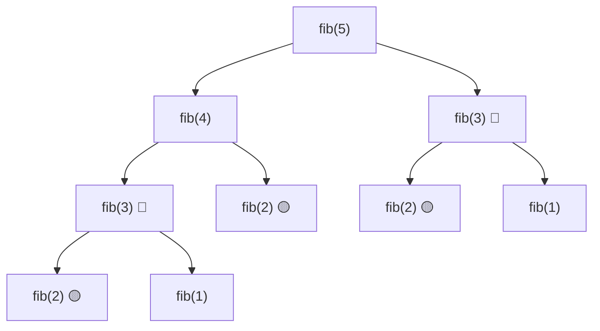
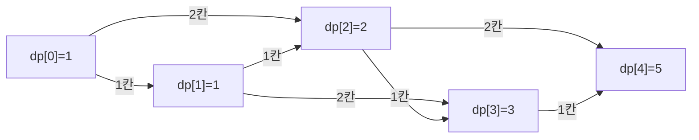

## 개요

**동적 프로그래밍(Dynamic Programming, DP)**은 큰 문제를 작은 부분 문제로 나누고, 각 부분 문제의 결과를 저장해 재사용함으로써 **중복 계산을 없애는** 기법입니다.

DP가 적용 가능하려면 두 조건을 만족해야 합니다.

1. **최적 부분구조** (Optimal Substructure): 전체 문제의 최적해가 부분 문제의 최적해로 구성됨
2. **중복 부분 문제** (Overlapping Subproblems): 같은 부분 문제가 여러 번 등장함

## 왜 필요한가 — 피보나치 수열

피보나치 수열의 점화식은 간단합니다.

$$
F(n) = \begin{cases} 1 & n \le 1 \\ F(n-1) + F(n-2) & n \ge 2 \end{cases}
$$

이를 그대로 재귀로 구현하면 어떻게 될까요?

```cpp
int fib(int n) {
    if (n <= 1) return n;
    return fib(n - 1) + fib(n - 2);
}
```
{: file="fib_naive.cpp" }

`fib(5)`를 호출할 때 실제 호출 트리를 보면 문제가 보입니다.



`fib(3)`이 2번, `fib(2)`이 3번 중복 계산됩니다. $n$이 커질수록 시간복잡도는 $O(2^n)$으로 폭발합니다.

> `fib(50)`만 해도 약 $2^{50} \approx 10^{15}$번의 연산이 필요합니다. 일반 재귀로는 사실상 불가능합니다.
{: .prompt-warning }

## DP의 두 가지 방식

### Top-Down (메모이제이션)

재귀 구조를 유지하면서, 이미 계산한 값을 배열에 저장(메모)해두고 재사용합니다.

```cpp
#include <bits/stdc++.h>
using namespace std;

long long memo[101];

long long fib(int n) {
    if (n <= 1) return n;
    if (memo[n] != -1) return memo[n];   // 이미 계산한 값은 바로 반환
    return memo[n] = fib(n - 1) + fib(n - 2);
}

int main() {
    fill(memo, memo + 101, -1);
    cout << fib(50) << "\n";   // 12586269025
}
```
{: file="fib_topdown.cpp" }

각 값은 딱 한 번만 계산됩니다. 시간복잡도 $O(n)$.

### Bottom-Up (타뷸레이션)

작은 문제부터 순서대로 계산해서 배열을 채워 나갑니다. 재귀 없이 반복문으로 구현합니다.

```cpp
long long fib_bottom_up(int n) {
    long long dp[101] = {};
    dp[0] = 0; dp[1] = 1;
    for (int i = 2; i <= n; i++)
        dp[i] = dp[i - 1] + dp[i - 2];
    return dp[n];
}
```
{: file="fib_bottomup.cpp" }

| 방식 | 장점 | 단점 |
|------|------|------|
| Top-Down | 점화식을 그대로 코드로 옮길 수 있어 직관적 | 재귀 오버헤드, 스택 오버플로 위험 |
| Bottom-Up | 반복문이라 빠르고 메모리 예측이 쉬움 | 불필요한 상태도 모두 계산할 수 있음 |

> PS에서는 보통 **Bottom-Up**을 선호합니다. 재귀 깊이 제한이 없고 속도가 더 빠릅니다.
{: .prompt-tip }

## 예제: 1차원 DP — 계단 오르기

**문제**: $n$번째 계단에 오르는 방법의 수를 구하세요. 한 번에 1칸 또는 2칸 오를 수 있습니다.

### 상태 정의

`dp[i]` = $i$번째 계단에 오르는 방법의 수

### 점화식 도출

$i$번째 계단에 오르는 방법은:
- $(i-1)$번째 계단에서 **1칸** 오르거나
- $(i-2)$번째 계단에서 **2칸** 오르거나

$$
dp[i] = dp[i-1] + dp[i-2]
$$

기저 조건: $dp[0] = 1$ (아무것도 안 오름), $dp[1] = 1$

### 상태 전이 시각화



결과: `dp = [1, 1, 2, 3, 5, 8, ...]` — 피보나치 수열과 동일한 구조입니다.

### 코드

```cpp
#include <bits/stdc++.h>
using namespace std;

int main() {
    int n;
    cin >> n;

    vector<long long> dp(n + 1, 0);
    dp[0] = 1;
    if (n >= 1) dp[1] = 1;

    for (int i = 2; i <= n; i++)
        dp[i] = dp[i - 1] + dp[i - 2];

    cout << dp[n] << "\n";
    return 0;
}
```
{: file="staircase.cpp" }

## DP 풀이 접근법

DP 문제를 만났을 때의 사고 순서:

1. **상태(State) 정의**: `dp[i]`가 무엇을 의미하는지 명확히 정의
2. **점화식 도출**: 현재 상태를 이전 상태로 표현
3. **기저 조건(Base case) 설정**: 가장 작은 문제의 답을 직접 입력
4. **계산 순서 결정**: Bottom-Up이면 작은 인덱스부터, Top-Down이면 재귀 순서

> 점화식이 떠오르지 않는다면 작은 예시(n=1, 2, 3, 4)를 직접 손으로 계산해 패턴을 찾으세요.
{: .prompt-tip }

## 복잡도

| 항목 | 값 |
|------|---|
| 시간복잡도 | $O(\text{상태 수} \times \text{전이 비용})$ |
| 공간복잡도 | $O(\text{상태 수})$ |

위 계단 문제의 경우: 시간 $O(n)$, 공간 $O(n)$.  
`dp[i]`가 `dp[i-1]`, `dp[i-2]`만 필요하므로 변수 2개로 $O(1)$ 공간 최적화도 가능합니다.

## 연습문제

| 번호 | 문제 | 핵심 |
|------|------|------|
| BOJ 1003 | [피보나치 함수](https://www.acmicpc.net/problem/1003) | DP 기초, 호출 횟수 카운팅 |
| BOJ 1463 | [1로 만들기](https://www.acmicpc.net/problem/1463) | 1D DP 최솟값 |
| BOJ 2579 | [계단 오르기](https://www.acmicpc.net/problem/2579) | 조건 있는 1D DP |
| BOJ 1149 | [RGB거리](https://www.acmicpc.net/problem/1149) | 상태가 2개인 1D DP |
| BOJ 9465 | [스티커](https://www.acmicpc.net/problem/9465) | 2행 DP |
