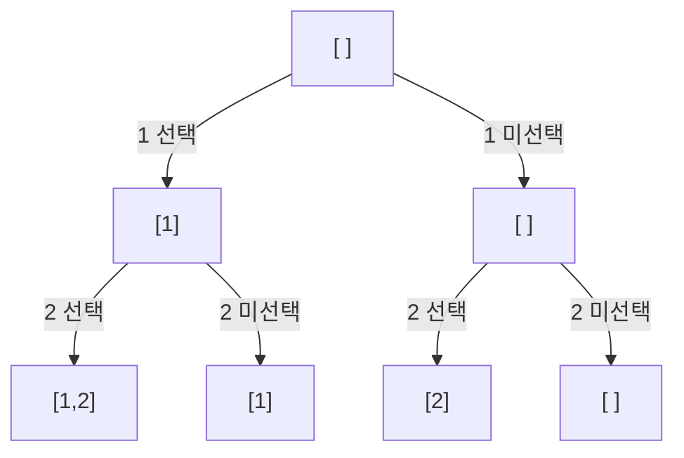

## 개요

**재귀(recursion)**는 함수가 자기 자신을 호출해 문제를 더 작은 같은 형태의 문제로 쪼개는 기법입니다. **백트래킹(backtracking)**은 재귀로 모든 경우를 탐색하되, 답이 될 수 없다고 판단되는 가지를 미리 잘라내(가지치기) 효율을 높이는 완전탐색입니다.

두 개념은 순열·조합 생성, 부분집합 나열, 퍼즐 풀이(N-Queen, 스도쿠) 등 "모든 경우의 수"를 다루는 문제의 토대입니다.

> 백트래킹은 결국 가지치기가 추가된 DFS입니다. 재귀 호출이 곧 한 단계 더 들어가는 것이고, 함수 종료가 곧 되돌아오는(back-track) 것입니다.
{: .prompt-info }

## 재귀의 구조

모든 재귀 함수는 두 부분으로 이루어집니다.

- **기저 조건(base case)** — 더 이상 쪼개지 않고 즉시 답을 반환하는 종료 지점
- **재귀 단계(recursive case)** — 더 작은 입력으로 자기 자신을 호출

기저 조건이 없거나 잘못되면 무한 재귀로 스택 오버플로가 납니다.

```cpp
long long factorial(int n) {
    if (n <= 1) return 1;        // 기저 조건
    return n * factorial(n - 1); // 재귀 단계
}
```
{: file="factorial.cpp" }

## 동작 원리 — 호출 트리

`{1, 2, 3}`의 모든 부분집합을 만드는 과정을, 각 원소를 "선택/미선택"하며 내려가는 트리로 그리면 다음과 같습니다. 리프(leaf)가 하나의 부분집합입니다.



원소가 $n$개면 리프는 $2^n$개입니다. 즉 부분집합 완전탐색은 $O(2^n)$입니다.

```cpp
#include <bits/stdc++.h>
using namespace std;

int n = 3;
vector<int> chosen;

void subsets(int idx) {
    if (idx == n) {            // 기저: 모든 원소 결정 완료
        for (int x : chosen) cout << x << " ";
        cout << "\n";
        return;
    }
    chosen.push_back(idx + 1); // idx번째 원소 선택
    subsets(idx + 1);
    chosen.pop_back();         // 선택 취소 (백트래킹)
    subsets(idx + 1);          // 미선택
}
```
{: file="subsets.cpp" }

## 백트래킹 — 가지치기

완전탐색이 모든 가지를 끝까지 보는 것과 달리, 백트래킹은 **"이 가지는 더 가도 답이 안 된다"**를 판단해 즉시 되돌아옵니다. 이 유망성(promising) 검사가 핵심입니다.

대표 예시는 **N-Queen**입니다. 같은 열·대각선에 퀸이 있으면 그 가지는 더 둘 필요가 없으므로 잘라냅니다.

```cpp
#include <bits/stdc++.h>
using namespace std;

int n, ans = 0;
int col[15];   // col[r] = r행에 놓은 퀸의 열

bool promising(int r) {
    for (int i = 0; i < r; i++) {
        if (col[i] == col[r]) return false;            // 같은 열
        if (abs(col[i] - col[r]) == abs(i - r)) return false; // 대각선
    }
    return true;
}

void solve(int r) {
    if (r == n) { ans++; return; } // 기저: n개 모두 놓음
    for (int c = 0; c < n; c++) {
        col[r] = c;
        if (promising(r))          // 유망할 때만 다음 행으로
            solve(r + 1);
    }
}
```
{: file="nqueen.cpp" }

가지치기가 없다면 $O(n^n)$을 모두 탐색하지만, 유망성 검사로 실제 탐색량이 크게 줄어듭니다.

## 복잡도

| 문제 유형 | 경우의 수 |
|-----------|-----------|
| 부분집합 | $O(2^n)$ |
| 순열 | $O(n!)$ |
| 중복 순열 | $O(n^k)$ |

가지치기는 빅오 상한을 바꾸지는 못하지만, 실측 시간을 수십~수백 배 줄여 제한 시간 통과를 가능하게 합니다.

## 변형 / 응용

### `next_permutation`

순열을 직접 재귀로 만들지 않고 STL로 사전순으로 생성할 수 있습니다. **정렬된 상태에서 시작**해야 모든 순열을 얻습니다.

```cpp
vector<int> v = {1, 2, 3};
do {
    for (int x : v) cout << x << " ";
    cout << "\n";
} while (next_permutation(v.begin(), v.end()));
```
{: file="next_permutation.cpp" }

## 연습문제

| 출처 | 문제 | 핵심 포인트 |
|------|------|-------------|
| 프로그래머스 | [소수 찾기](https://school.programmers.co.kr/learn/courses/30/lessons/42839) | 순열 생성 + 완전탐색 |
| 프로그래머스 | [피로도](https://school.programmers.co.kr/learn/courses/30/lessons/87946) | 순열 백트래킹 |
| BOJ 15649 | N과 M (1) *(번호로만 표기)* | 순열 생성 |
| BOJ 9663 | N-Queen *(번호로만 표기)* | 가지치기 백트래킹 |

> BOJ(백준)는 2026-04-28 사이트 종료로 링크 대신 번호만 표기합니다.
{: .prompt-info }
