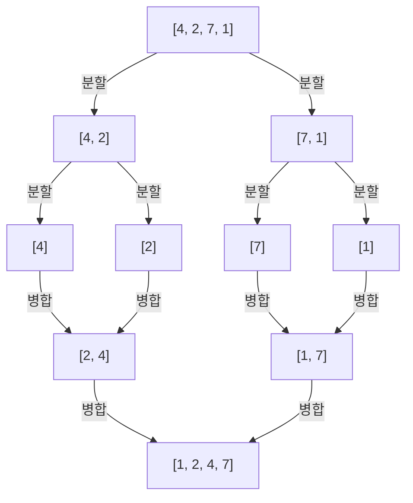
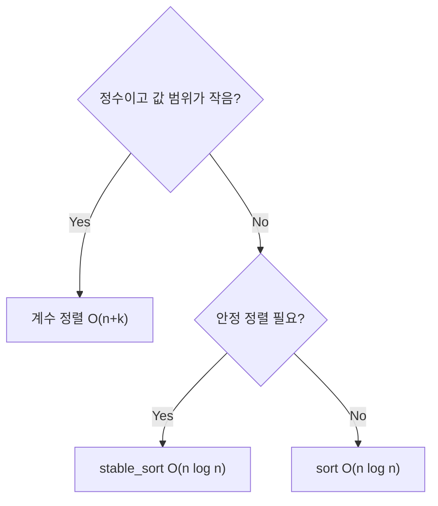

## 개요

정렬(Sorting)은 데이터를 특정 순서로 나열하는 것입니다. 이진 탐색, 그리디, 스위핑 등 수많은 알고리즘의 전처리 단계로 쓰이기 때문에 PS에서 반드시 알아야 하는 기초입니다.

정렬 알고리즘은 비교 방식에 따라 크게 두 가지로 분류됩니다.

| 분류 | 알고리즘 | 최선 | 평균 | 최악 |
|------|---------|------|------|------|
| 비교 기반 $O(n^2)$ | 버블, 선택, 삽입 | $O(n)$ | $O(n^2)$ | $O(n^2)$ |
| 비교 기반 $O(n \log n)$ | 합병, 퀵, 힙 | $O(n \log n)$ | $O(n \log n)$ | $O(n^2)$\* |
| 비비교 기반 | 계수, 기수 | — | $O(n+k)$ | $O(n+k)$ |

\* 퀵 정렬 최악은 피벗 선택이 나쁠 때. STL의 `sort`는 내부적으로 introsort를 사용해 $O(n \log n)$ 보장.

> PS에서는 대부분 `std::sort`를 사용합니다. 정렬 알고리즘 직접 구현이 필요한 경우는 많지 않지만, 원리를 알아야 응용 문제(계수정렬, 정렬 기준 커스터마이징 등)를 풀 수 있습니다.
{: .prompt-info }

## O(n²) 정렬

### 버블 정렬 (Bubble Sort)

인접한 두 원소를 비교해 순서가 맞지 않으면 교환하는 과정을 반복합니다.

```
[5, 3, 8, 1]
→ [3, 5, 1, 8]  (1회 패스)
→ [3, 1, 5, 8]  (2회 패스)
→ [1, 3, 5, 8]  (3회 패스)
```

```cpp
void bubble_sort(vector<int>& a) {
    int n = a.size();
    for (int i = 0; i < n - 1; i++)
        for (int j = 0; j < n - 1 - i; j++)
            if (a[j] > a[j + 1]) swap(a[j], a[j + 1]);
}
```
{: file="bubble_sort.cpp" }

### 선택 정렬 (Selection Sort)

전체에서 최솟값을 찾아 맨 앞으로 보내는 과정을 반복합니다.

```
[5, 3, 8, 1]
→ [1, 3, 8, 5]  (최솟값 1을 인덱스 0으로)
→ [1, 3, 8, 5]  (최솟값 3은 이미 제자리)
→ [1, 3, 5, 8]  (최솟값 5를 인덱스 2로)
```

```cpp
void selection_sort(vector<int>& a) {
    int n = a.size();
    for (int i = 0; i < n - 1; i++) {
        int min_idx = i;
        for (int j = i + 1; j < n; j++)
            if (a[j] < a[min_idx]) min_idx = j;
        swap(a[i], a[min_idx]);
    }
}
```
{: file="selection_sort.cpp" }

### 삽입 정렬 (Insertion Sort)

현재 원소를 이미 정렬된 앞부분의 적절한 위치에 삽입합니다. **이미 거의 정렬된 배열**에서는 $O(n)$에 가깝게 동작합니다.

```cpp
void insertion_sort(vector<int>& a) {
    int n = a.size();
    for (int i = 1; i < n; i++) {
        int key = a[i];
        int j = i - 1;
        while (j >= 0 && a[j] > key) {
            a[j + 1] = a[j];
            j--;
        }
        a[j + 1] = key;
    }
}
```
{: file="insertion_sort.cpp" }

## O(n log n) 정렬

### 합병 정렬 (Merge Sort)

분할 정복(Divide & Conquer) 방식입니다. 배열을 절반으로 나눠 각각 정렬한 뒤 병합합니다.



병합 단계에서 두 정렬된 배열을 합치는 데 $O(n)$, 이 과정이 $O(\log n)$ 레벨에 걸쳐 일어나므로 전체 $O(n \log n)$입니다.

```cpp
void merge_sort(vector<int>& a, int left, int right) {
    if (left >= right) return;

    int mid = (left + right) / 2;
    merge_sort(a, left, mid);
    merge_sort(a, mid + 1, right);

    // 병합
    vector<int> tmp;
    int i = left, j = mid + 1;
    while (i <= mid && j <= right) {
        if (a[i] <= a[j]) tmp.push_back(a[i++]);
        else               tmp.push_back(a[j++]);
    }
    while (i <= mid)  tmp.push_back(a[i++]);
    while (j <= right) tmp.push_back(a[j++]);

    for (int k = left; k <= right; k++)
        a[k] = tmp[k - left];
}
```
{: file="merge_sort.cpp" }

합병 정렬은 **안정 정렬**(stable sort)이며, 추가 $O(n)$ 메모리가 필요합니다.

### 퀵 정렬 (Quick Sort)

피벗을 기준으로 작은 값은 왼쪽, 큰 값은 오른쪽으로 분리한 뒤 재귀적으로 정렬합니다.

평균 $O(n \log n)$이지만, 피벗이 항상 최댓값/최솟값으로 선택되면 최악 $O(n^2)$이 됩니다.

```cpp
void quick_sort(vector<int>& a, int left, int right) {
    if (left >= right) return;

    int pivot = a[(left + right) / 2];
    int i = left, j = right;
    while (i <= j) {
        while (a[i] < pivot) i++;
        while (a[j] > pivot) j--;
        if (i <= j) swap(a[i++], a[j--]);
    }
    quick_sort(a, left, j);
    quick_sort(a, i, right);
}
```
{: file="quick_sort.cpp" }

> 경쟁 프로그래밍에서는 직접 짠 퀵 정렬을 쓰지 말고 `std::sort`를 쓰세요. 최악 케이스를 의도적으로 만드는 테스트케이스가 존재하는 경우가 있습니다.
{: .prompt-warning }

## C++ STL — std::sort

PS에서 가장 많이 쓰는 방식입니다. 내부적으로 Introsort(퀵 + 힙 + 삽입의 하이브리드)를 사용해 **최악 $O(n \log n)$**을 보장합니다.

```cpp
#include <bits/stdc++.h>
using namespace std;

int main() {
    vector<int> a = {5, 3, 8, 1, 9, 2};

    // 오름차순 (기본)
    sort(a.begin(), a.end());

    // 내림차순
    sort(a.begin(), a.end(), greater<int>());

    // 커스텀 비교 함수
    sort(a.begin(), a.end(), [](int x, int y) {
        return x > y;  // 내림차순
    });

    // pair: 첫 번째 기준 오름차순, 같으면 두 번째 기준 내림차순
    vector<pair<int,int>> v;
    v.push_back({3, 2}); v.push_back({1, 5}); v.push_back({3, 1});
    sort(v.begin(), v.end(), [](auto& x, auto& y) {
        if (x.first != y.first) return x.first < y.first;
        return x.second > y.second;
    });
}
```
{: file="stl_sort.cpp" }

## 계수 정렬 (Counting Sort)

값의 범위가 $k$로 제한될 때 사용합니다. 시간복잡도 $O(n + k)$로 비교 기반 정렬의 하한인 $\Omega(n \log n)$을 깨뜨릴 수 있습니다.

```cpp
void counting_sort(vector<int>& a, int max_val) {
    vector<int> cnt(max_val + 1, 0);
    for (int x : a) cnt[x]++;

    int idx = 0;
    for (int v = 0; v <= max_val; v++)
        while (cnt[v]--) a[idx++] = v;
}
```
{: file="counting_sort.cpp" }

값 범위가 $10^6$ 이하이고 정수일 때 유용합니다. (BOJ 10989, 수 정렬하기 3)

## 어떤 정렬을 써야 할까?



## 복잡도 요약

| 알고리즘 | 평균 | 최악 | 안정 | 추가 메모리 |
|---------|------|------|------|------------|
| 버블 정렬 | $O(n^2)$ | $O(n^2)$ | ✓ | $O(1)$ |
| 선택 정렬 | $O(n^2)$ | $O(n^2)$ | ✗ | $O(1)$ |
| 삽입 정렬 | $O(n^2)$ | $O(n^2)$ | ✓ | $O(1)$ |
| 합병 정렬 | $O(n \log n)$ | $O(n \log n)$ | ✓ | $O(n)$ |
| 퀵 정렬 | $O(n \log n)$ | $O(n^2)$ | ✗ | $O(\log n)$ |
| `std::sort` | $O(n \log n)$ | $O(n \log n)$ | ✗ | $O(\log n)$ |
| 계수 정렬 | $O(n+k)$ | $O(n+k)$ | ✓ | $O(k)$ |

## 연습문제

| 번호 | 문제 | 핵심 |
|------|------|------|
| BOJ 2750 | [수 정렬하기](https://www.acmicpc.net/problem/2750) | 기본 정렬 구현 |
| BOJ 2751 | [수 정렬하기 2](https://www.acmicpc.net/problem/2751) | $O(n \log n)$ 필요 |
| BOJ 10989 | [수 정렬하기 3](https://www.acmicpc.net/problem/10989) | 계수 정렬 |
| BOJ 11650 | [좌표 정렬하기](https://www.acmicpc.net/problem/11650) | 커스텀 비교 함수 |
| BOJ 1181 | [단어 정렬](https://www.acmicpc.net/problem/1181) | 다중 기준 정렬 |
| BOJ 10814 | [나이순 정렬](https://www.acmicpc.net/problem/10814) | 안정 정렬 |
