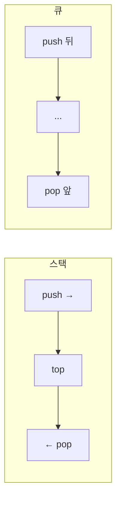

## 개요

같은 데이터라도 **어디에 넣고 어디서 빼느냐**의 규칙이 다르면 쓰임새가 완전히 달라집니다. 이 글에서 다루는 네 자료구조는 모두 원소를 한 줄로 관리하지만, 접근 규칙이 서로 다릅니다.

| 자료구조 | 규칙 | 핵심 쓰임 |
|----------|------|-----------|
| 스택(Stack) | LIFO (나중에 넣은 것 먼저) | 괄호 검사, DFS, 되돌리기 |
| 큐(Queue) | FIFO (먼저 넣은 것 먼저) | BFS, 시뮬레이션 |
| 덱(Deque) | 양쪽 끝 삽입·삭제 | 슬라이딩 윈도 |
| 우선순위 큐(PQ) | 우선순위 높은 것 먼저 | 다익스트라, 그리디 |



## 스택 (Stack)

마지막에 넣은 원소가 가장 먼저 나옵니다(LIFO). 괄호 짝 맞추기, 후위 표기법 계산, DFS의 명시적 구현 등에 쓰입니다.

```cpp
#include <bits/stdc++.h>
using namespace std;

int main() {
    stack<int> st;
    st.push(1);
    st.push(2);
    cout << st.top() << "\n"; // 2 (가장 최근)
    st.pop();                 // 2 제거
    cout << st.size() << "\n";// 1
    cout << st.empty() << "\n";
}
```
{: file="stack.cpp" }

대표 예시는 **괄호 검사**입니다. 여는 괄호는 push, 닫는 괄호를 만나면 top과 짝을 맞추고 pop 합니다. 끝까지 비면 올바른 괄호열입니다.

## 큐 (Queue)

먼저 넣은 원소가 먼저 나옵니다(FIFO). **BFS**가 큐를 쓰는 가장 대표적인 알고리즘입니다.

```cpp
queue<int> q;
q.push(1);
q.push(2);
cout << q.front() << "\n"; // 1 (가장 먼저 넣은 것)
q.pop();                   // 1 제거
cout << q.back() << "\n";  // 2
```
{: file="queue.cpp" }

## 덱 (Deque)

앞뒤 양쪽에서 모두 삽입·삭제가 가능합니다. 슬라이딩 윈도에서 최댓값/최솟값을 $O(n)$에 유지하는 "모노토닉 덱"에 쓰입니다.

```cpp
deque<int> dq;
dq.push_back(2);   // 뒤로 삽입
dq.push_front(1);  // 앞으로 삽입  -> [1, 2]
dq.pop_front();    // 앞에서 제거  -> [2]
dq.pop_back();     // 뒤에서 제거  -> []
```
{: file="deque.cpp" }

## 우선순위 큐 (Priority Queue)

넣은 순서와 무관하게 **우선순위가 가장 높은 원소가 먼저** 나옵니다. 내부적으로 힙(heap)으로 구현되어 삽입·삭제가 $O(\log n)$입니다. 다익스트라, 그리디 스케줄링 등에 필수입니다.

```cpp
// 기본: 최대 힙 (가장 큰 값이 top)
priority_queue<int> max_pq;
max_pq.push(3); max_pq.push(1); max_pq.push(5);
cout << max_pq.top() << "\n"; // 5

// 최소 힙 (가장 작은 값이 top)
priority_queue<int, vector<int>, greater<int>> min_pq;
min_pq.push(3); min_pq.push(1); min_pq.push(5);
cout << min_pq.top() << "\n"; // 1
```
{: file="priority_queue.cpp" }

> 최소 힙은 `priority_queue<int, vector<int>, greater<int>>`로 선언합니다. 자주 쓰는 패턴이니 통째로 외워 두면 편합니다.
{: .prompt-tip }

## 복잡도 요약

| 자료구조 | 삽입 | 삭제 | 최상위 조회 |
|----------|------|------|-------------|
| 스택 | $O(1)$ | $O(1)$ | $O(1)$ |
| 큐 | $O(1)$ | $O(1)$ | $O(1)$ |
| 덱 | $O(1)$ | $O(1)$ | $O(1)$ |
| 우선순위 큐 | $O(\log n)$ | $O(\log n)$ | $O(1)$ |

## 연습문제

| 출처 | 문제 | 핵심 포인트 |
|------|------|-------------|
| 프로그래머스 | [주식가격](https://school.programmers.co.kr/learn/courses/30/lessons/42584) | 스택 / 모노토닉 |
| 프로그래머스 | [다리를 지나는 트럭](https://school.programmers.co.kr/learn/courses/30/lessons/42583) | 큐 시뮬레이션 |
| 프로그래머스 | [이중우선순위큐](https://school.programmers.co.kr/learn/courses/30/lessons/42628) | 우선순위 큐 / multiset |
| BOJ 9012 | 괄호 *(번호로만 표기)* | 스택 짝 맞추기 |
| BOJ 10866 | 덱 *(번호로만 표기)* | 덱 기본 연산 |

> BOJ(백준)는 2026-04-28 사이트 종료로 링크 대신 번호만 표기합니다.
{: .prompt-info }
