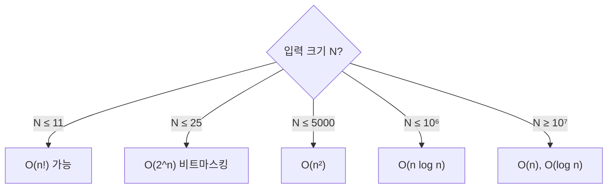

## 개요

같은 문제를 푸는 알고리즘이 여럿일 때, 어느 것이 더 빠른지 객관적으로 비교하려면 기준이 필요합니다. **시간복잡도**는 입력 크기 $n$이 커질 때 연산 횟수가 어떻게 증가하는지를, **공간복잡도**는 메모리 사용량이 어떻게 증가하는지를 나타냅니다.

PS에서 복잡도 분석이 중요한 이유는 단순합니다. **알고리즘을 구현하기 _전에_ 시간 초과(TLE) 여부를 예측**할 수 있기 때문입니다. 제한 시간과 입력 크기를 보면 어떤 복잡도까지 허용되는지 가늠할 수 있습니다.

> "일단 짜고 제출해 본다"가 아니라 "이 복잡도면 통과한다"를 먼저 판단하는 습관이 실력의 차이를 만듭니다.
{: .prompt-info }

## 빅오 표기법

빅오 표기법 $O(\cdot)$은 입력이 충분히 클 때 연산 횟수의 **증가율 상한**을 나타냅니다. 상수 계수와 낮은 차수 항은 무시합니다.

$$
3n^2 + 5n + 100 \;\Rightarrow\; O(n^2)
$$

자주 등장하는 복잡도를 느린 순서대로 나열하면 다음과 같습니다.

$$
O(1) < O(\log n) < O(n) < O(n \log n) < O(n^2) < O(2^n) < O(n!)
$$

| 복잡도 | 이름 | 예시 |
|--------|------|------|
| $O(1)$ | 상수 | 배열 인덱스 접근 |
| $O(\log n)$ | 로그 | 이분 탐색 |
| $O(n)$ | 선형 | 배열 순회 |
| $O(n \log n)$ | 선형로그 | 정렬, 분할 정복 |
| $O(n^2)$ | 이차 | 이중 반복문 |
| $O(2^n)$ | 지수 | 부분집합 완전탐색 |
| $O(n!)$ | 팩토리얼 | 순열 완전탐색 |

## 시간 제한 감각

대부분의 PS 채점 환경에서 **1초에 약 $10^8$ ~ $10^9$번의 단순 연산**을 처리한다고 봅니다. 이를 기준으로 입력 크기 $n$에 따라 허용되는 복잡도를 거꾸로 추정할 수 있습니다.

| $n$ 의 범위 | 목표 복잡도 |
|------------|------------|
| $n \le 11$ | $O(n!)$ |
| $n \le 25$ | $O(2^n)$ |
| $n \le 500$ | $O(n^3)$ |
| $n \le 5{,}000$ | $O(n^2)$ |
| $n \le 10^6$ | $O(n \log n)$ |
| $n \le 10^8$ | $O(n)$ |

> 이 표는 절대적인 기준이 아니라 **출발점**입니다. 상수 계수가 크거나(예: STL 컨테이너 다수 사용) 연산이 무거우면 한 단계 보수적으로 잡으세요.
{: .prompt-warning }

## 공간복잡도

메모리 제한(보통 256MB)도 함께 고려해야 합니다. C++에서 자료형별 크기와 배열 용량을 어림하면 됩니다.

- `int` = 4바이트, `long long`/`double` = 8바이트
- 256MB $\approx$ `int` $6.7 \times 10^7$개

예를 들어 `int dp[10000][10000]`은 $10^8 \times 4\text{B} = 400\text{MB}$로 **메모리 초과**입니다. 2차원 배열을 잡을 때는 항상 곱을 먼저 계산하세요.

## 변형 / 응용

### 최악 vs 평균 vs 분할상환

- **최악(worst-case)**: PS에서 기본 기준. TLE는 최악 입력에서 결정됩니다.
- **평균(average)**: 퀵 정렬의 $O(n \log n)$처럼 무작위 입력 가정.
- **분할상환(amortized)**: `vector`의 `push_back`은 가끔 재할당($O(n)$)이 일어나지만, $n$번에 걸쳐 평균 내면 한 번당 $O(1)$입니다.

### 로그의 밑은 무시한다

$O(\log_2 n)$과 $O(\log_{10} n)$은 상수 배 차이뿐이므로 빅오에서는 모두 $O(\log n)$으로 씁니다.

## 연습문제

복잡도 자체를 묻는 문제는 적지만, 모든 문제 풀이가 곧 복잡도 추정 연습입니다. 아래는 "코드의 연산 횟수를 직접 세어 보는" 입문 문제들입니다.

| 출처 | 문제 | 핵심 포인트 |
|------|------|-------------|
| BOJ 24262 | 알고리즘 수업 - 알고리즘의 수행 시간 1 *(번호로만 표기)* | $O(1)$ 연산 횟수 |
| BOJ 24263 | 알고리즘 수업 - 알고리즘의 수행 시간 2 *(번호로만 표기)* | $O(n)$ 연산 횟수 |
| BOJ 24264 | 알고리즘 수업 - 알고리즘의 수행 시간 3 *(번호로만 표기)* | $O(n^2)$ 연산 횟수 |

> BOJ(백준)는 2026-04-28 사이트 종료로 링크 대신 번호만 표기합니다.
{: .prompt-info }
